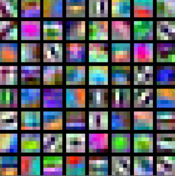
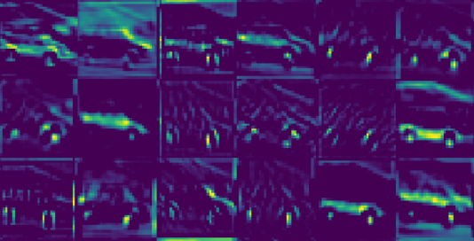
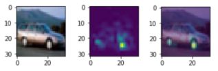
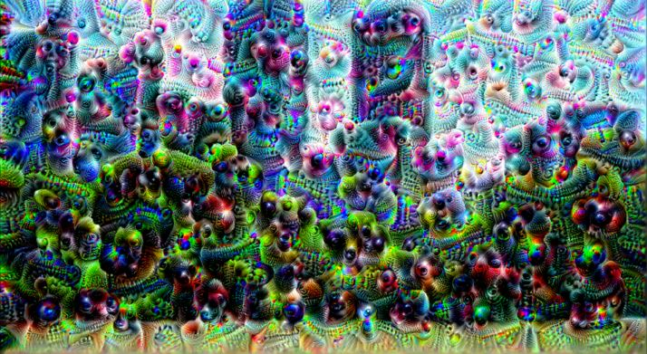

# K-CAI NEURAL API [](https://github.com/joaopauloschuler/k-neural-api/releases)[](https://zenodo.org/badge/latestdoi/221215803)


K-CAI NEURAL API is a Keras based neural network API that allows you to:
* Create parameter-efficient neural networks: [V1](https://github.com/joaopauloschuler/kEffNetV1) and [V2](https://github.com/joaopauloschuler/kEffNetV2).
* Create [noise-resistant neural networks](https://github.com/joaopauloschuler/two-path-noise-lab-plant-disease) for image classification and [achieve state-of-the-art classification accuracy](https://github.com/joaopauloschuler/two-branch-plant-disease).
* Use an extremely well tested data augmentation wrapper for image classification (see `cai.util.create_image_generator` below).
* Add [non-standard layers](https://github.com/joaopauloschuler/k-neural-api#new-layers) to your neural network.
* Visualize [first layer filters](https://github.com/joaopauloschuler/k-neural-api#first-layer-filters), [activation maps](https://github.com/joaopauloschuler/k-neural-api#activation-maps), [heatmaps](https://github.com/joaopauloschuler/k-neural-api#heatmaps) ([see example](https://colab.research.google.com/github/joaopauloschuler/k-neural-api/blob/master/examples/jupyter/activation_map_heatmap_with_cifar10.ipynb)) and [gradient ascent](https://github.com/joaopauloschuler/k-neural-api#gradient-ascent--deep-dream) ([see example](https://colab.research.google.com/github/joaopauloschuler/k-neural-api/blob/master/examples/jupyter/cai_gradient_ascent.ipynb)).
* [Prototype convolutional neural networks faster](https://github.com/joaopauloschuler/k-neural-api#quick-start-with-image-classification-on-your-own-web-browser) ([see example](https://colab.research.google.com/github/joaopauloschuler/k-neural-api/blob/master/examples/jupyter/simple_image_classification_with_any_dataset.ipynb)).
* Save a [Tensorflow dataset](https://www.tensorflow.org/datasets) for image classification into a local folder structure: `cai.datasets.save_tfds_in_format`. See [example](https://colab.research.google.com/github/joaopauloschuler/k-neural-api/blob/master/examples/jupyter/k_cai_tfds_example.ipynb).

This project is a subproject from a bigger and older project called [CAI](https://sourceforge.net/projects/cai/) and is sister to the [free pascal](https://www.freepascal.org/) based [CAI NEURAL API](https://github.com/joaopauloschuler/neural-api/).

## Prerequisites
All you need is [Keras](https://keras.io/), [python](https://www.python.org/) and [pip](https://pypi.org/project/pip/). Alternatively, if you prefer running on your [web browser](https://colab.research.google.com/github/joaopauloschuler/k-neural-api/blob/master/examples/jupyter/simple_image_classification_with_any_dataset.ipynb) without installing any software on your computer, you can run it on [Google Colab](https://colab.research.google.com/github/joaopauloschuler/k-neural-api/blob/master/examples/jupyter/simple_image_classification_with_any_dataset.ipynb). [](https://colab.research.google.com/github/joaopauloschuler/k-neural-api/blob/master/examples/jupyter/simple_image_classification_with_any_dataset.ipynb)

### Quick Start with Image Classification on Your Own Web Browser
For a quick start, you can try the [Simple Image Classification with any Dataset](https://colab.research.google.com/github/joaopauloschuler/k-neural-api/blob/master/examples/jupyter/simple_image_classification_with_any_dataset.ipynb) example. This example shows how to create a model and train it with a dataset passed as parameter. Feel free to modify the parameters and to add/remove neural layers directly from your browser. [](https://colab.research.google.com/github/joaopauloschuler/k-neural-api/blob/master/examples/jupyter/simple_image_classification_with_any_dataset.ipynb)

## Installation
### Via Shell
Installing via shell is very simple:
```
git clone https://github.com/joaopauloschuler/k-neural-api.git k
cd k && pip install .
```
### Installing on Google Colab
Place this on the top of your Google Colab Jupyter Notebook:
```
import os

if not os.path.isdir('k'):
  !git clone https://github.com/joaopauloschuler/k-neural-api.git k
else:
  !cd k && git pull

!cd k && pip install .
```

## Documentation
The documentation is composed by **examples** and **PyDoc**.

### Image Classification Examples
These examples show how to train a neural network for the task of [image classification](https://towardsdatascience.com/wtf-is-image-classification-8e78a8235acb). Most examples train a neural network with the [CIFAR-10](https://en.wikipedia.org/wiki/CIFAR-10) or [CIFAR-100](https://en.wikipedia.org/wiki/CIFAR-10) datasets.
* [Simple Image Classification with any Dataset](https://github.com/joaopauloschuler/k-neural-api/blob/master/examples/jupyter/simple_image_classification_with_any_dataset.ipynb): this example shows how to create a model and train it with a dataset passed as parameter. [](https://colab.research.google.com/github/joaopauloschuler/k-neural-api/blob/master/examples/jupyter/simple_image_classification_with_any_dataset.ipynb)
* [DenseNet BC L40 with CIFAR-10](https://github.com/joaopauloschuler/k-neural-api/blob/master/examples/jupyter/cai_densenet_bc_l40_with_cifar_10.ipynb): this example shows how to create a densenet model with `cai.densenet.simple_densenet` and easily train it with `cai.datasets.train_model_on_cifar10`. [](https://colab.research.google.com/github/joaopauloschuler/k-neural-api/blob/master/examples/jupyter/cai_densenet_bc_l40_with_cifar_10.ipynb)
* [DenseNet BC L40 with CIFAR-100](https://github.com/joaopauloschuler/k-neural-api/blob/master/examples/jupyter/cai_densenet_bc_l40_with_cifar_100.ipynb): this example shows how to create a densenet model with `cai.densenet.simple_densenet` and easily train it with `cai.datasets.train_model_on_dataset`. [](https://colab.research.google.com/github/joaopauloschuler/k-neural-api/blob/master/examples/jupyter/cai_densenet_bc_l40_with_cifar_100.ipynb)
* [Experiment your own DenseNet Architecture](https://github.com/joaopauloschuler/k-neural-api/blob/master/examples/jupyter/densenet_with_cifar.ipynb): this example allows you to experiment your own DenseNet settings. [](https://colab.research.google.com/github/joaopauloschuler/k-neural-api/blob/master/examples/jupyter/densenet_with_cifar.ipynb)
* [Saving a TensorFlow dataset into png files](https://colab.research.google.com/github/joaopauloschuler/k-neural-api/blob/master/examples/jupyter/k_cai_tfds_example.ipynb) so you can use the dataset with Keras image generator.

### Advanced Image Classification Examples
These papers show how to create parameter-efficient models (source code is available):
* [An Enhanced Scheme for Reducing the Complexity of Pointwise Convolutions in CNNs for Image Classification Based on Interleaved Grouped Filters without Divisibility Constraints](https://github.com/joaopauloschuler/kEffNetV2).
* [Grouped Pointwise Convolutions Reduce Parameters in Convolutional Neural Networks](https://github.com/joaopauloschuler/kEffNetV1).
* [Color-aware two-branch DCNN for efficient plant disease classification](https://github.com/joaopauloschuler/two-branch-plant-disease).
* [Grouped Pointwise Convolutions Significantly Reduces Parameters in EfficientNet](https://github.com/joaopauloschuler/kEffNet).
* [Making plant disease classification noise resistant](https://github.com/joaopauloschuler/two-path-noise-lab-plant-disease).

### First Layer Filters
The [Heatmap and Activation Map with CIFAR-10](https://github.com/joaopauloschuler/k-neural-api/blob/master/examples/jupyter/activation_map_heatmap_with_cifar10.ipynb) example shows how to quickly display heatmaps (CAM), activation maps and first layer filters/patterns.

These are filter examples:

<p></img></p>

Above image has been created with a code similar to this:

```
weights = model.get_layer('layer_name').get_weights()[0]
neuron_patterns = cai.util.show_neuronal_patterns(weights, NumRows = 8, NumCols = 8, ForceCellMax = True)
...
plt.imshow(neuron_patterns, interpolation='nearest', aspect='equal')
```

### Activation Maps
These are activation map examples:

<p></img></p>

The above shown activation maps have been created with a code similar to this:

```
conv_output = cai.models.PartialModelPredict(InputImage, model, 'layer_name', False)
...
activation_maps = cai.util.slice_3d_into_2d(aImage=conv_output[0], NumRows=8, NumCols=8, ForceCellMax=True);
...
plt.imshow(activation_maps, interpolation='nearest', aspect='equal')
```

### Heatmaps
The following image shows a car (left - input sample), its heatmap (center) and both added together (right).

<p></img></p>

Heatmaps can be produced following this example:

```
heat_map = cai.models.calculate_heat_map_from_dense_and_avgpool(InputImage, image_class, model, pOutputLayerName='last_conv_layer', pDenseLayerName='dense')
```

### Gradient Ascent & Deep Dream
With **cai.gradientascent.run_gradient_ascent_octaves**, you can easily run gradient ascent to create Deep Dream like images:
```
base_model = tf.keras.applications.InceptionV3(include_top=False, weights='imagenet')
pmodel = cai.models.CreatePartialModel(base_model, 'mixed3')
new_img = cai.gradientascent.run_gradient_ascent_octaves(img=original_img, partial_model=pmodel, low_range=-4, high_range=1)
plt.figure(figsize = (16, 16))
plt.imshow(new_img, interpolation='nearest', aspect='equal')
plt.show()
```

<p></img></p>

Above image was generated from:

<p></img></p>

There is a ready to use example: [Gradient Ascent / Deep Dream Example](https://github.com/joaopauloschuler/k-neural-api/blob/master/examples/jupyter/cai_gradient_ascent.ipynb). [](https://colab.research.google.com/github/joaopauloschuler/k-neural-api/blob/master/examples/jupyter/cai_gradient_ascent.ipynb)

### PyDoc
After installing K-CAI, you can find documentation with:
```
python -m pydoc cai.datasets
python -m pydoc cai.densenet
python -m pydoc cai.layers
python -m pydoc cai.models
python -m pydoc cai.util
```

### Scientific Research
These papers were made with K-CAI API:
* [An Enhanced Scheme for Reducing the Complexity of Pointwise Convolutions in CNNs for Image Classification Based on Interleaved Grouped Filters without Divisibility Constraints](https://www.researchgate.net/publication/363413038_An_Enhanced_Scheme_for_Reducing_the_Complexity_of_Pointwise_Convolutions_in_CNNs_for_Image_Classification_Based_on_Interleaved_Grouped_Filters_without_Divisibility_Constraints).
* [Grouped Pointwise Convolutions Reduce Parameters in Convolutional Neural Networks](https://www.researchgate.net/publication/360226228_Grouped_Pointwise_Convolutions_Reduce_Parameters_in_Convolutional_Neural_Networks).
* [Grouped Pointwise Convolutions Significantly Reduces Parameters in EfficientNet](https://www.researchgate.net/publication/355214501_Grouped_Pointwise_Convolutions_Significantly_Reduces_Parameters_in_EfficientNet).
* [Reliable Deep Learning Plant Leaf Disease Classification Based on Light-Chroma Separated Branches](https://www.researchgate.net/publication/355215213_Reliable_Deep_Learning_Plant_Leaf_Disease_Classification_Based_on_Light-Chroma_Separated_Branches).
* [Color-aware two-branch DCNN for efficient plant disease classification](https://www.researchgate.net/publication/361511874_Color-Aware_Two-Branch_DCNN_for_Efficient_Plant_Disease_Classification).

## Feature List
* A number of new layer types (see below).
* `cai.util.create_image_generator`: this wrapper has extremely well tested default parameters for image classification data augmentation. For you to get a better image classification accuracy might be just a case of replacing your current data augmentation generator by this one. Give it a go!
* `cai.util.create_image_generator_no_augmentation`: image generator for test datasets.
* `cai.densenet.simple_densenet`: simple way to create DenseNet models. See [example](https://github.com/joaopauloschuler/k-neural-api/blob/master/examples/jupyter/cai_densenet_bc_l40_with_cifar_10.ipynb).
* `cai.datasets.load_hyperspectral_matlab_image`: downloads (if required) and loads hyperspectral image from a matlab file. This function has been tested with [AVIRIS](http://www.ehu.eus/ccwintco/index.php/Hyperspectral_Remote_Sensing_Scenes) and ROSIS sensor data stored as a matlab files.
* `cai.models.calculate_heat_map_from_dense_and_avgpool`: calculates a class activation mapping (CAM) inspired on the paper [Learning Deep Features for Discriminative Localization](https://arxiv.org/abs/1512.04150) (see example below).
* `cai.util.show_neuronal_patterns`: creates an array for visualizing first layer neuronal filters/patterns (see example below).
* `cai.models.CreatePartialModel(pModel, pOutputLayerName, hasGlobalAvg=False)`: creates a partial model up to the layer name defined in pOutputLayerName.
* `cai.models.CreatePartialModelCopyingChannels(pModel, pOutputLayerName, pChannelStart, pChannelCount)`: creates a partial model up to the layer name defined in pOutputLayerName and then copies channels starting from pChannelStart with pChannelCount channels.
* `cai.models.CreatePartialModelFromChannel(pModel, pOutputLayerName, pChannelIdx)`: creates a partial model up to the layer name defined in pOutputLayerName and then copies the channel at index pChannelIdx. Use it in combination with `cai.gradientascent.run_gradient_ascent_octaves` to run gradient ascent from a specific channel or neuron.
* `cai.models.CreatePartialModelWithSoftMax(pModel, pOutputLayerName, numClasses, newLayerName='k_probs')`: creates a partial model up to the layer name defined in pOutputLayerName and then adds a dense layer with softmax. This method was built to be used for image classification with transfer learning.
* `cai.gradientascent.run_gradient_ascent_octaves`: allows visualizing patterns recognized by inner neuronal layers. See [example](https://colab.research.google.com/github/joaopauloschuler/k-neural-api/blob/master/examples/jupyter/cai_gradient_ascent.ipynb). Use it in combination with `cai.models.CreatePartialModel`, `cai.models.CreatePartialModelCopyingChannels` or `cai.models.CreatePartialModelFromChannel`.
* `cai.datasets.save_tfds_in_format`: saves a TensorFlow dataset as image files. Classes are folders. See [example](https://colab.research.google.com/github/joaopauloschuler/k-neural-api/blob/master/examples/jupyter/k_cai_tfds_example.ipynb).
* `cai.datasets.load_images_from_folders`: practical way to load small datasets into memory. It supports smart resizing, LAB color encoding and bipolar inputs.

## New Layers
* `cai.layers.ConcatNegation`: concatenates the input with its negation (input tensor multiplied by -1).
* `cai.layers.CopyChannels`: copies a subset of the input channels.
* `cai.layers.EnforceEvenChannelCount`: enforces that the number of channels is even (divisible by 2).
* `cai.layers.FitChannelCountTo`: forces the number of channels to fit a specific number of channels. The new number of channels must be bigger than the number of input channels. The number of channels is fitted by concatenating copies of existing channels.
* `cai.layers.GlobalAverageMaxPooling2D`: adds both global Average and Max poolings. `cai.layers.GlobalAverageMaxPooling2D` speeds up training when used as a replacement for standard average pooling and max pooling.
* `cai.layers.InterleaveChannels`: interleaves channels stepping according to the number passed as parameter.
* `cai.layers.kPointwiseConv2D`: parameter-efficient pointwise convolution as shown in the papers [Grouped Pointwise Convolutions Reduce Parameters in Convolutional Neural Networks](https://github.com/joaopauloschuler/kEffNetV1) and [An Enhanced Scheme for Reducing the Complexity of Pointwise Convolutions in CNNs for Image Classification Based on Interleaved Grouped Filters without Divisibility Constraints](https://github.com/joaopauloschuler/kEffNetV2).
* `cai.layers.Negate`: negates (multiplies by -1) the input tensor.
* `cai.layers.SumIntoHalfChannels`: divedes channels into 2 halfs and then sums both halfs. This results into an output with the half of the input channels.

## Give this Project a Star
This project is an open source project. If you like what you see, please give it a star on github.

## Citing this API
You can cite this API in BibTeX format with:
```
@software{k_cai_neural_api_2021_5810092,
  author       = {Joao Paulo Schwarz Schuler},
  title        = {K-CAI NEURAL API},
  month        = dec,
  year         = 2021,
  publisher    = {Zenodo},
  doi          = {10.5281/zenodo.5810092},
  url          = {https://doi.org/10.5281/zenodo.5810092}
}
```
